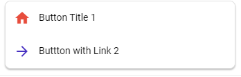

# webBlocks

export const Highlight = ({ children, color, fontColor = "#fff" }) => (
  <span
    style={{
      backgroundColor: color,
      borderRadius: "4px",
      color: fontColor,
      padding: "0.4rem",
      marginTop: "0.3rem",
    }}
  >
    {children}
  </span>
);

import Tabs from "@theme/Tabs";
import TabItem from "@theme/TabItem";

WebBlocks are used to build structures with **Dialogflow Messenger**

### webParagraph

> Display texts that doesn't have any behaviors or something special that differences it from other blocks

<Tabs>
<TabItem value="simple" label="One Paragraph">


<Tabs>
<TabItem value="php" label="PHP">

```php
$pTitleArray = ["Title1"];
$pSubtitleArray = ["Subtitle1"];

webParagraph($pTitleArray, $pSubtitleArray);
```

</TabItem>
<TabItem value="nodejs" label="Node.js">

```nodejs
ALPHA
```

</TabItem>
</Tabs>

</TabItem>
<TabItem value="complex" label="Two or More Paragraphs">


<Tabs>
<TabItem value="php" label="PHP">

```php
$pTitleArray = ["Title1","title2"];
$pSubtitleArray = ["Subtitle1","subtitle2"];

webParagraph($pTitleArray, $pSubtitleArray);
```

</TabItem>
<TabItem value="nodejs" label="Node.js">

```nodejs
ALPHA
```

</TabItem>
</Tabs>

</TabItem>
</Tabs>

### webCard

> Displays a Card and doesnt have any behavior like triggering events, texts or links. This block is strongly recommended to use with webImage in order to provide a image.

> In addition, this block is the most usefull to combine with other actionBlocks (blocks that perform and action and arent just informational) like webButton, webReply and webList.

> Accordeon Text inse the card can have styles (different Color, font being Bold, Italic or Underline) with the span function (look at the example below).

<Tabs>
<TabItem value="simple" label="One Card">


<Tabs>
<TabItem value="php" label="PHP">

```php
$aTitleArray = ["Title"];
$aSubtitleArray = ["Subtitle"];
$aTextArray = ["Subtitle"];

webCard($aTitleArray, $aSubtitleArray, $aTextArray);
```

</TabItem>
<TabItem value="nodejs" label="Node.js">

```nodejs
ALPHA
```

</TabItem>
</Tabs>

</TabItem>
<TabItem value="complex" label="Two or More Cards">


<Tabs>
<TabItem value="php" label="PHP">

```php
$aTitleArray = ["Title1","title2"];
$aSubtitleArray = ["Subtitle1","subtitle2"];
$aTextArray = ["text1","text 2"];

webCard($aTitleArray, $aSubtitleArray, $aTextArray);
```

</TabItem>
<TabItem value="nodejs" label="Node.js">

```nodejs
ALPHA
```

</TabItem>
</Tabs>

</TabItem>
</Tabs>

### webButton

<!-- **Is used to display a Button** -->

> - Displays a Button that can be stacked indefinitely with other buttons.
> - Button works in two ways depending what you pass on **customArray** if you pass a link (you will get a redirection with target blank) if just text, a Event with this text as name will be triggered.
> - Buttons can be used with all blocks but the most recommended is the webCard block
> - Button Icons can be found [**HERE**](https://material.io/resources/icons/?style=baseline), in order to use one of them you have just to paste the name of the choosed icon.
> - Button Color correspond to a HEX color Format (Example : <Highlight color="#F08080">#F08080</Highlight> )

<Tabs>
<TabItem value="simple" label="One Button">

;

<Tabs>
<TabItem value="php" label="PHP">

```php
$bTitleArray = ["Button Title 1"];
$bCustomArray = ["eventName"];
$bIconArray = ["home"];
$bColorArray = ["#F08080"];

webButton($bTitleArray, $bCustomArray, $bIconArray, $bColorArray);
```

</TabItem>
<TabItem value="nodejs" label="Node.js">

```nodejs
ALPHA
```

</TabItem>
</Tabs>

</TabItem>
<TabItem value="complex" label="Two or More Buttons">

;

<Tabs>
<TabItem value="php" label="PHP">

```php
$bTitleArray = ["Button Title 1", "Buttton with Link 2"];
$bCustomArray = ["eventName","https://google.com"];
$bIconArray = ["home","arrow_forward"];
$bColorArray = ["#F08080","#F08080"];

webButton($bTitleArray, $bCustomArray, $bIconArray, $bColorArray);
```

</TabItem>
<TabItem value="nodejs" label="Node.js">

```nodejs
ALPHA
```

</TabItem>
</Tabs>

</TabItem>
</Tabs>

### webReply

> Displays one title and multiple options to choose
> They can work on two different ways depending what you put on their customArray, if you put a link (They will work as an a Hyperlink) if you put a word, this will be the default message outputted if the user press on that specific chip.
> Replies Stacks indefinitely and are separed in a Flexbox Css way.

<Tabs>
<TabItem value="simple" label="One Reply">


<Tabs>
<TabItem value="php" label="PHP">

```php
$cTitleArray = ["Chip Title1"];
$cImageArray = ["https://chipsImageURl.com"];
$cCustomArray = ["Chip Text"];

webReply($cTitleArray, $cImageArray, $cCustomArray);
```

</TabItem>
<TabItem value="nodejs" label="Node.js">

```nodejs
ALPHA
```

</TabItem>
</Tabs>

</TabItem>
<TabItem value="complex" label="Two or More Replies">


<Tabs>
<TabItem value="php" label="PHP">

```php
$cTitleArray = ["Chip Title1","Chips title 2"];
$cImageArray = ["https://chipsImageURl.com","https://chipsImageURl.com"];
$cCustomArray = ["Chip Text","https://chips.com"];

webReply($cTitleArray, $cImageArray, $cCustomArray);
```

</TabItem>
<TabItem value="nodejs" label="Node.js">

```nodejs
ALPHA
```

</TabItem>
</Tabs>

</TabItem>
</Tabs>

### webImage

**Displays a simple image**

> - Images can be stacked indifinelty, but only one can be used for an Accordeon

<Tabs>
<TabItem value="simple" label="One Image">


<Tabs>
<TabItem value="php" label="PHP">

```php
$iImageArray = ["https://imageurl.com"];
$iTextArray = ["Image Alt Text"];

webImage($iImageArray, $iTextArray);
```

</TabItem>
<TabItem value="nodejs" label="Node.js">

```nodejs
ALPHA
```

</TabItem>
</Tabs>

</TabItem>
<TabItem value="complex" label="Two or More Images">


<Tabs>
<TabItem value="php" label="PHP">

```php
$iImageArray = ["https://imageurl.com","https://imageurl.com"];
$iTextArray = ["Image Alt Text","Image Alt Text"];

webImage($iImageArray, $iTextArray);
```

</TabItem>
<TabItem value="nodejs" label="Node.js">

```nodejs
ALPHA
```

</TabItem>
</Tabs>

</TabItem>
</Tabs>

### webList

**Displays horizontal Cards**

> - Lists can work as Buttons, if you put a link in their customPart these will work as hyperlink, if just a text, will trigger an Event with that name.

<Tabs>
<TabItem value="simple" label="One List">


<Tabs>
<TabItem value="php" label="PHP">

```php
$lTitleArray = ["Title list"];
$lSubtitleArray = ["Subtitle List"];
$lImageArray = ["https://imageurl.com"];
$lCustomArray = ["https://hyperlink.com"];

webList($lTitleArray, $lSubtitleArray, $lImageArray, $lCustomArray);
```

</TabItem>
<TabItem value="nodejs" label="Node.js">

```nodejs
ALPHA
```

</TabItem>
</Tabs>

</TabItem>
<TabItem value="complex" label="Two or More Lists">


<Tabs>
<TabItem value="php" label="PHP">

```php
$lTitleArray = ["Title list","Title list 2"];
$lSubtitleArray = ["Subtitle List","Subtitle list 2"];
$lImageArray = ["https://imageurl.com","https://imageurl.com"];
$lCustomArray = ["https://hyperlink.com","TextEvent"];

webList($lTitleArray, $lSubtitleArray, $lImageArray, $lCustomArray);
```

</TabItem>
<TabItem value="nodejs" label="Node.js">

```nodejs
ALPHA
```

</TabItem>
</Tabs>

</TabItem>
</Tabs>

### webDescription

**Provides a simple Paragraph with no Styles**

> - A Simple text with lot of Paragraphs
> - Depending of how many text you pass as index you will get separated paragraphs.

<Tabs>
<TabItem value="simple" label="One Description">


<Tabs>
<TabItem value="php" label="PHP">

```php
$dTitleArray = ["Title"];
$dTextArray = [["Text1","Text2"]];

webDescription($dTitleArray, $dTextArray);
```

</TabItem>
<TabItem value="nodejs" label="Node.js">

```nodejs
ALPHA
```

</TabItem>
</Tabs>

</TabItem>
<TabItem value="complex" label="Two or More Descriptions">


<Tabs>
<TabItem value="php" label="PHP">

```php
$dTitleArray = ["Title2","Title2"];
$dTextArray = [["Text1","Text2"],["Text3","Text4"]];

webDescription($dTitleArray, $dTextArray);
```

</TabItem>
<TabItem value="nodejs" label="Node.js">

```nodejs
ALPHA
```

</TabItem>
</Tabs>

</TabItem>
</Tabs>
