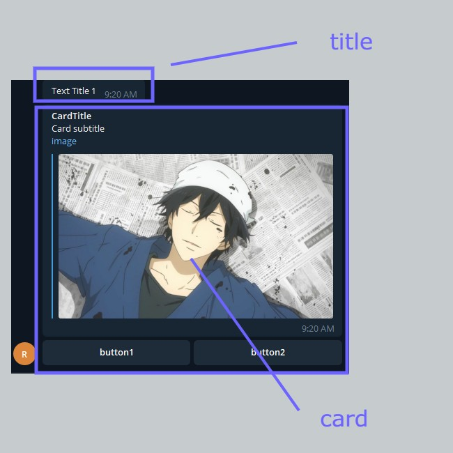

# tgTemplates

import Tabs from "@theme/Tabs";
import TabItem from "@theme/TabItem";

tgTemplates are used to build nice structures in a Telegram Environment. These templates are created to work with Telegram.

### tgStructureTemplate

**fbStructureTemplate help us to create a custom Structure**

> - You can use whatever block you want but take in mind that you have to separate it with a separator (comma).
> - In order to make structure work, you can paste all the name's structures inside of structure, and the components required in the component array.
> - If you dont know already what to do with context please make it false and just declare contextBody as null. (You can find Context in doc).
> - External or Generic Blocks should be used inside of open/close Payloads.
> - Available tgBlocks are **image paragraph reply card** These can be located in blocks -> tgBlocks.

<Tabs>
<TabItem value="php" label="PHP">

```php
$context = false;
$contextBody = [];
$tgTitle = ["test"];

$tgTextArray = ["Text Title 1"];

$cImageArray = ["https://ramenparados.com/wp-content/uploads/2018/06/Barakamon-destacado-1000x600.jpg"];
$cTitleArray = ["CardTitle"];
$cSubtitleArray = ["Card subtitle"];
$cButtonTextArray = [
    ["button1","button2"]
];
$cButtonCustomArray = [
    ["button1","button2"]
];

$structure = ['paragraph','comma','card'];
$components = [
    [$tgTextArray],
    [],
    [$cImageArray,  $cTitleArray,  $cSubtitleArray,  $cButtonTextArray,  $cButtonCustomArray]
];

tgStructureTemplate($context,$contextBody,$tgTitle,$structure,$components);
```

</TabItem>
<TabItem value="nodejs" label="Node.js">

```nodejs
ALPHA
```

</TabItem>
</Tabs>

#### Example of Template shown above


