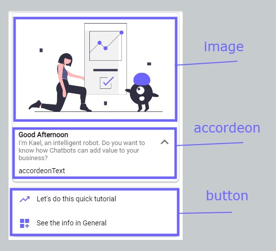

# webTemplates

import Tabs from "@theme/Tabs";
import TabItem from "@theme/TabItem";

WebTemplates are used to build nice structures in a Web Environment. These templates are created to work with Dialogflow Messenger.

## webStructureTemplate

**webStructureTemplate help us to create a custom Structure**

> - You can use whatever block you want but take in mind that you have to separate it with a separator (Choose what best fits to you).
> - In order to make structure work, you can paste all the name's structures inside of structure, and the components required in the component array
> - If you dont know already what to do with context please make it false and just declare contextBody as nothing. (You can find Context in doc)
> - Available webBlocks are **card button reply description image list paragraph** These can be located in blocks -> webBlocks
> - Available separators are **comma basicDivider commaDivider superDivider**

> - You can build a structure with the blocks or use this Structure Template Tool [**HERE**](https://github.com/)

<Tabs>
<TabItem value="php" label="PHP">

```php
$context = false;
$contextBody = [];
$webTitle = ["intentName"];

$imageArray = ["imageurl"];
$aTitleArray = ["Card Title"];
$aSubtitleArray = ["Card Subtitle"];
$aTextArray = ["Card Accordeon Text"];

$bTitleArray = ["Button Title 1","ButtonTitle2"];
$bCustomArray = ["button Custom 1","button Custom 2"];
$bIconArray = ["Button Icon","Button Icon 2"];
$bColorArray = ["#00efff","#000fff"];


$structure = ['image','comma','card','superDivider','button'];
$components = [
    [$imageArray,$webTitle],
    [],
    [$imageArray,$aTitleArray,$aSubtitleArray,$aTextArray],
    [],
    [$bTitleArray,$bCustomArray,$bIconArray,$bColorArray]
];

webStructureTemplate($context, $contextBody, $webTitle, $structure, $components);
```

</TabItem>
<TabItem value="nodejs" label="Node.js">

```js
context = false;
contextBody = [];
webTitle = ["intentName"];

structure = ["image", "comma", "card", "superDivider", "button"];
components = [
  [imageArray, webTitle],
  [],
  [imageArray, titleArray, aSubtitleArray, aTextArray],
  [],
  [bTitleArray, bCustomArray, bIconArray, bColorArray];

result = webStructureTemplate(context, contextBody, webTitle, structure, components);
```

</TabItem>
</Tabs>

#### Example of Template shown above



<!-- ## **Deprecated**

#### webDescriptionTemplate

**Description template for web**

> - If you dont know already what to do with context please make it false and just declare contextBody as nothing. (You can find Context in doc)

<Tabs>
<TabItem value="php" label="PHP">

```php
$context = false;
$contextBody = array();
$webTitle = array("intentName");

$dTitleArray = array("Description Title 1");
$dTextArray = array("Description text 1");

webDescriptionTemplate($context,$contextBody,$webTitle,$dTitleArray,$dTextArray);
```

</TabItem>
<TabItem value="nodejs" label="Node.js">

```nodejs
ALPHA
```

</TabItem>
</Tabs>

### webParagraphTemplate

**Paragraph template for web**

> - If you dont know already what to do with context please make it false and just declare contextBody as nothing. (You can find Context in doc)

<Tabs>
<TabItem value="php" label="PHP">

```php
$context = false;
$contextBody = array();
$webTitle = array("intentName");

$pTitleArray = array("Title1");
$pSubtitleArray = array("Subtitle1");

webParagraphTemplate($context,$contextBody,$webTitle,$pTitleArray,$pSubtitleArray);
```

</TabItem>
<TabItem value="nodejs" label="Node.js">

```nodejs
ALPHA
```

</TabItem>
</Tabs>

### webChipsTemplate

**Chip template for web**

> - If you dont know already what to do with context please make it false and just declare contextBody as nothing. (You can find Context in doc)

<Tabs>
<TabItem value="php" label="PHP">

```php
$context = false;
$contextBody = array();
$webTitle = array("intentName");

$cTitleArray = array("Chip 1 Title","Chip 2 Title");
$cImageArray = array("https://chip1urlimage.com","https://chip2urlimage.com");
$cCustomArray = array("chip1Custom","https://chipurl.com");

webChipsTemplate($context,$contextBody,$webTitle,$cTitleArray,$cImageArray,$cCustomArray);
```

</TabItem>
<TabItem value="nodejs" label="Node.js">

```nodejs
ALPHA
```

</TabItem>
</Tabs>

### webAccordeonTemplate

**Accordeon template for web**

> - If you dont know already what to do with context please make it false and just declare contextBody as nothing. (You can find Context in doc)

<Tabs>
<TabItem value="php" label="PHP">

```php
$context = false;
$contextBody = array();
$webTitle = array("intentName");

$aImageArray = array("https://chip1urlimage.com");
$aTitleArray = array("Title");
$aSubtitleArray = array("Subtitle");
$aTextArray = array("Text");

webAccordeonTemplate($context,$contextBody,$webTitle,$aImageArray,$aTitleArray,$aSubtitleArray,$aTextArray);
```

</TabItem>
<TabItem value="nodejs" label="Node.js">

```nodejs
ALPHA
```

</TabItem>
</Tabs>

### webButtonTemplate

**Button template for web**

> - If you dont know already what to do with context please make it false and just declare contextBody as nothing. (You can find Context in doc)

<Tabs>
<TabItem value="php" label="PHP">

```php
$context = false;
$contextBody = array();
$webTitle = array("intentName");

$bTitleArray = array("Button 1 Title","Button 2 Title");
$bCustomArray = array("Button 1 Custom","https://buttonurl.com");
$bIconArray = array("button1Icon","home");
$bColorArray = array("$red","#fff");

webButtonTemplate($context,$contextBody,$webTitle,$bTitleArray,$bCustomArray,$bIconArray,$bColorArray);
```

</TabItem>
<TabItem value="nodejs" label="Node.js">

```nodejs
ALPHA
```

</TabItem>
</Tabs>

### webImageTemplate

**Image template for web**

> - If you dont know already what to do with context please make it false and just declare contextBody as nothing. (You can find Context in doc)

<Tabs>
<TabItem value="php" label="PHP">

```php
$context = false;
$contextBody = array();
$webTitle = array("intentName");

$iImageArray = array("https://imageurl.com");


webImageTemplate($context,$contextBody,$webTitle,$iImageArray);
```

</TabItem>
<TabItem value="nodejs" label="Node.js">

```nodejs
ALPHA
```

</TabItem>
</Tabs>

### webListTemplate

**List template for web**

> - If you dont know already what to do with context please make it false and just declare contextBody as nothing. (You can find Context in doc)

<Tabs>
<TabItem value="php" label="PHP">

```php
$context = false;
$contextBody = array();
$webTitle = array("intentName");

$lTitleArray = array("List Title Array","List Title Array");
$lSubtitleArray = array("List Subtitle Array","List Subtitle Array");
$lImageArray = array("https://listimageurl.com","https://listimageurl.com");
$lCustomArray = array("listEvent","https://google.com");

webListTemplate($context,$contextBody,$webTitle,$lTitleArray,$lSubtitleArray,$lImageArray,$lCustomArray);
```

</TabItem>
<TabItem value="nodejs" label="Node.js">

```nodejs
ALPHA
```

</TabItem>
</Tabs>

### webImageAccordeonButtonTemplate

**Card template for web**

> - If you dont know already what to do with context please make it false and just declare contextBody as nothing. (You can find Context in doc)

<Tabs>
<TabItem value="php" label="PHP">

```php
$context = false;
$contextBody = array();
$webTitle = array("intentName");

$aImageArray = array("https://chip1urlimage.com");
$aTitleArray = array("Title");
$aSubtitleArray = array("Subtitle");
$aTextArray = array("Text");

$bTitleArray = array("Button 1 Title","Button 2 Title");
$bCustomArray = array("Button 1 Custom","https://buttonurl.com");
$bIconArray = array("button1Icon","home");
$bColorArray = array("$red","#fff");

webImageAccordeonButtonTemplate($context,$contextBody,$webTitle,$aImageArray,$aTitleArray,$aSubtitleArray,$aTextArray,$bTitleArray,$bCustomArray,$bIconArray,$bColorArray);
```

</TabItem>
<TabItem value="nodejs" label="Node.js">

```nodejs
ALPHA
```

</TabItem>
</Tabs> -->
